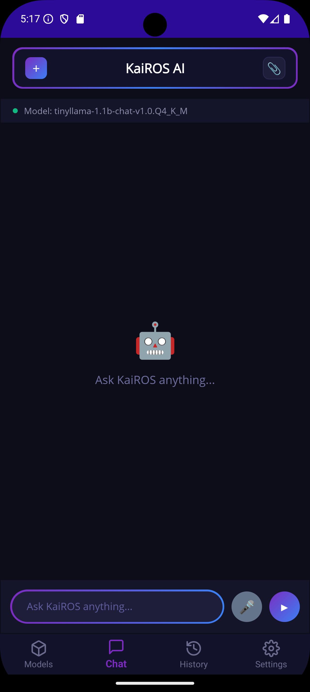
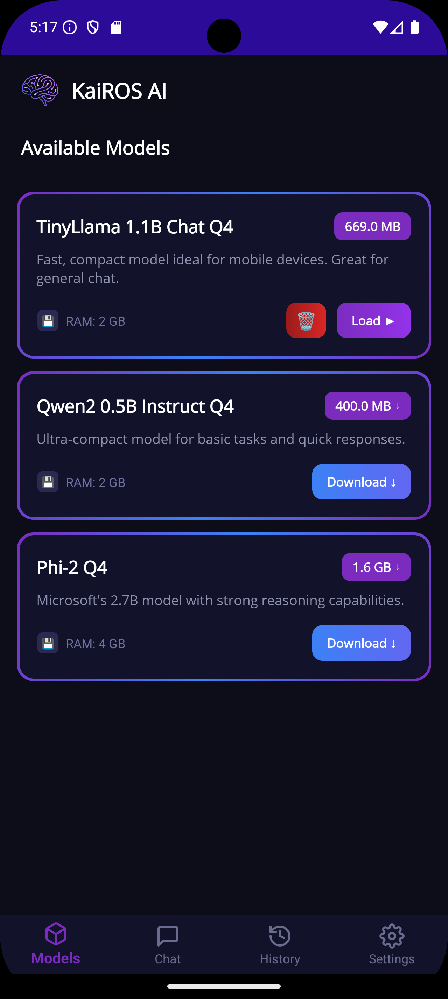
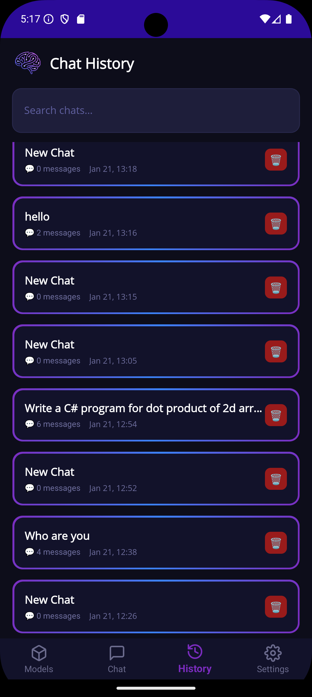
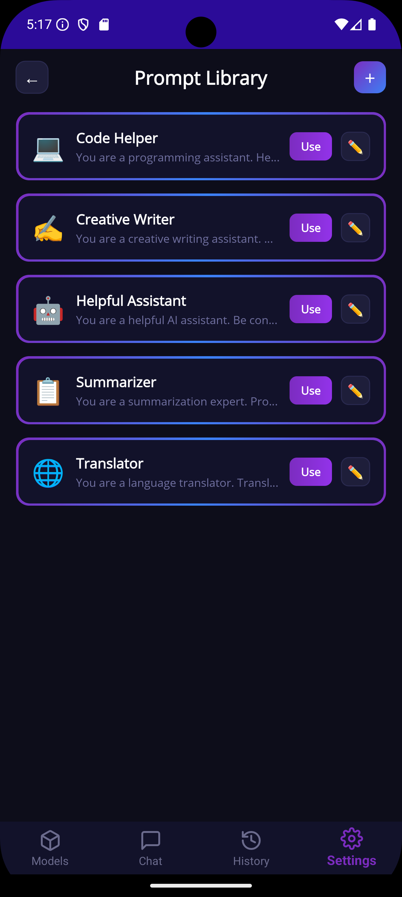
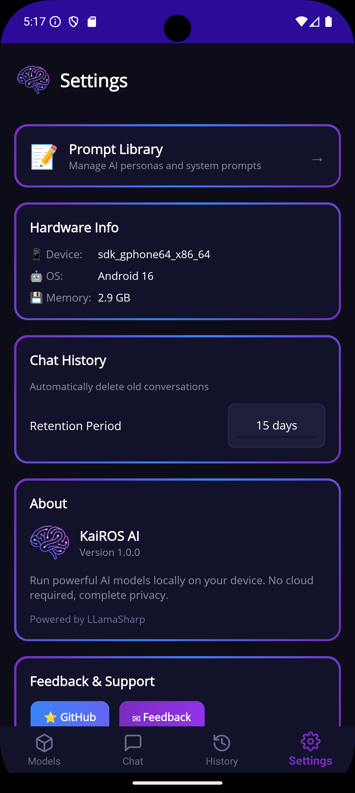

# KaiROS AI

<p align="center">
  
</p>

<p align="center">
  <b>A powerful local AI assistant for Windows & Android</b><br>
  Run LLMs locally on your device • No cloud required • Privacy-first
</p>

<p align="center">
  <a href="https://github.com/avikeid2007/Kairos.local/releases/latest"></a>
  
  
  
  
  
</p>

---

## 📥 Download

<p align="center">
  <a href="https://github.com/avikeid2007/Kairos.local/releases/latest">
    
  </a>
  <a href="https://apps.microsoft.com/detail/9n0l64zr0znd?hl=en-US&gl=IN" target="_blank">
      
  </a>
  <br>
  <a href="https://github.com/avikeid2007/Kairos.local/releases/latest">
    
  </a>
  
</p>

- **[Download Latest Release](https://github.com/avikeid2007/Kairos.local/releases/latest)** - Windows Installer & Android APK
- **Microsoft Store** - [Get it now](https://apps.microsoft.com/detail/9n0l64zr0znd?hl=en-US&gl=IN)
- **Play Store** - 🔜 Coming Soon!
- No .NET installation required
- Supports Windows 10/11 (x64) & Android 7.0+

---

## 🆚 Feature Comparison

| Feature | Windows Desktop | Android Mobile |
|---------|:---------------:|:--------------:|
| **Local LLM Inference** | ✅ | ✅ |
| **Model Manager** | ✅ | ✅ |
| **Chat Interface** | ✅ | ✅ |
| **Chat History** | ✅ | ✅ |
| **System Prompt Editing** | ✅ | ✅ |
| **Custom Model Import** | ✅ | ✅ |
| **Markdown Rendering** | ✅ | ✅ |
| **RAG (Document Chat)** | ✅ | ✅ |
| **Local REST API** | ✅ | ❌ |
| **System Tray Support** | ✅ | ❌ |
| **DirectML & Vulkan** | ✅ | ❌ |

---

## 🖥️ Desktop Version (Windows)

The Desktop version is the full-featured powerhouse, designed for productivity and integration.

### Key Features

- **RAG (Retrieval Augmented Generation)**: Chat with your PDF, DOCX, and TXT files locally.
- **Local REST API Server**: Integrate your local models with VS Code (Continue), LM Studio, or your own apps.
- **System Tray Integration**: Keep your AI assistant running in the background.
- **Advanced GPU Support**: Full support for CUDA, DirectML, and Vulkan backends.

### Desktop Screenshots

| Model Catalog | Chat Interface |
|:---:|:---:|
|  |  |

| RAG (Document Chat) | Settings |
|:---:|:---:|
|  |  |

---

## 📱 Mobile Version (Android)

The Mobile version brings the power of local AI to your pocket. Optimized for touch and on-the-go usage.

### Key Features

- **Offline Capable**: Run LLMs anywhere, even without an internet connection (after model download).
- **Battery Efficient**: Optimized for mobile processors.
- **Clean UI**: A simplified interface focused on chat and quick interactions.
- **Chat History**: Save and resume your conversations anytime.

### Mobile Screenshots

| Chat Interface | Model Selection |
|:---:|:---:|
|  |  |

| Chat History | System Prompt |
|:---:|:---:|
|  |  |

| Settings | |
|:---:|:---:|
|  | |

---

## ✨ Shared Features

### Core Capabilities

- 🤖 **Run LLMs Locally** - No internet required after model download
- 📦 **Model Catalog** - 31 pre-configured models from 9 organizations
- ⬇️ **Download Manager** - Pause, resume, and manage model downloads
- 💬 **Streaming Responses** - Real-time text generation
- 📊 **Performance Stats** - Real-time tokens/sec and memory usage

### Model Catalog

- 🏢 **Organization Sections** - Collapsible groups for Qwen, Google, Meta, Microsoft, and more
- 🔍 **Advanced Filtering** - Filter by Organization, Family, Variant (CPU-Only, GPU-Recommended)
- 🏷️ **Visual Badges** - Category, family, variant, and download status indicators
- ➕ **Custom Models** - Add your own GGUF models from local files or URLs

### Advanced

- 🎨 **Modern Dark Theme** - Beautiful gradient-based UI design
- 💬 **Feedback Hub** - Send feedback directly from Settings

---

## 🔌 Local REST API (Desktop Only)

> **Build AI-powered applications without cloud dependencies!**

KaiROS AI includes a **fully local REST API server** - perfect for developers who want to integrate local LLMs into their applications.

### Quick Start

```bash
# Check status
curl http://localhost:5000/health

# Chat (non-streaming)
curl -X POST http://localhost:5000/chat \
  -H "Content-Type: application/json" \
  -d '{"messages":[{"role":"user","content":"Hello!"}]}'
```

**enable in Settings → API Server**

---

## 🚀 Getting Started

### Prerequisites

- **Windows 10/11** (x64)
- **Android 7.0+** (API 24+)
- **.NET 9 SDK** - [Download](https://dotnet.microsoft.com/download/dotnet/9.0)
- **CUDA Toolkit 12** (optional, for GPU acceleration) - [Download](https://developer.nvidia.com/cuda-downloads)

### Installation

1. **Clone the repository**

   ```bash
   git clone https://github.com/yourusername/KaiROS.AI.git
   cd KaiROS.AI
   ```

2. **Restore packages and build**

   ```bash
   dotnet restore
   dotnet build --configuration Release
   ```

3. **Run the application**

   ```bash
   dotnet run --project KaiROS.AI
   ```

## 📦 Model Catalog Overview

### Supported Organizations

| Organization | Highlights |
|--------------|------------|
| **Qwen** | Qwen 2.5/3 series (0.5B - 14B) - Excellent multilingual |
| **Google** | Gemma 2/3 models (270M - 27B) - High quality |
| **Meta** | LLaMA 3.1/3.2 + TinyLlama |
| **Microsoft** | Phi-2, Phi-3, BitNet b1.58 |
| **MistralAI** | Mistral 7B, Mistral Small 24B |
| **Open Source** | GPT-oss 20B ⚠️ Experimental |

### Recommended Models ⭐

- **Phi-3 Mini 3.8B** - Best for general conversations (4 GB RAM)
- **Qwen 2.5 3B** - Excellent multilingual and coding (4 GB RAM)
- **Mistral 7B** - Complex reasoning tasks (8 GB RAM)

---

## 🛠️ Tech Stack

- **Framework**: .NET 9 + WPF (Windows) / MAUI (Android)
- **LLM Runtime**: [LLamaSharp 0.25.0](https://github.com/SciSharp/LLamaSharp)
- **MVVM**: [CommunityToolkit.Mvvm 8.4.0](https://github.com/CommunityToolkit/dotnet)
- **GPU Support**: CUDA 12, DirectML, Vulkan
- **Model Format**: GGUF (llama.cpp compatible)
- **Database**: SQLite (for custom models)

## 📁 Project Structure

```
KaiROS.AI/
├── Assets/              # App icons and images
├── Converters/          # XAML value converters
├── Models/              # Data models
├── Services/            # Business logic
├── Themes/              # UI styling
├── ViewModels/          # MVVM ViewModels
├── Views/               # XAML views
└── appsettings.json     # Model catalog config
```

## 🤝 Contributing & License

Contributions are welcome! Please feel free to submit a Pull Request.
This project is licensed under the MIT License - see the [LICENSE](LICENSE) file for details.

## 🙏 Acknowledgments

- [LLamaSharp](https://github.com/SciSharp/LLamaSharp) - Excellent .NET bindings for llama.cpp - **This project wouldn't be possible without LLamaSharp!**
- [llama.cpp](https://github.com/ggerganov/llama.cpp) - High-performance LLM inference in C/C++
- [Hugging Face](https://huggingface.co/) - Model hosting and community

---

<p align="center">
  Made with ❤️ for local AI enthusiasts
</p>
